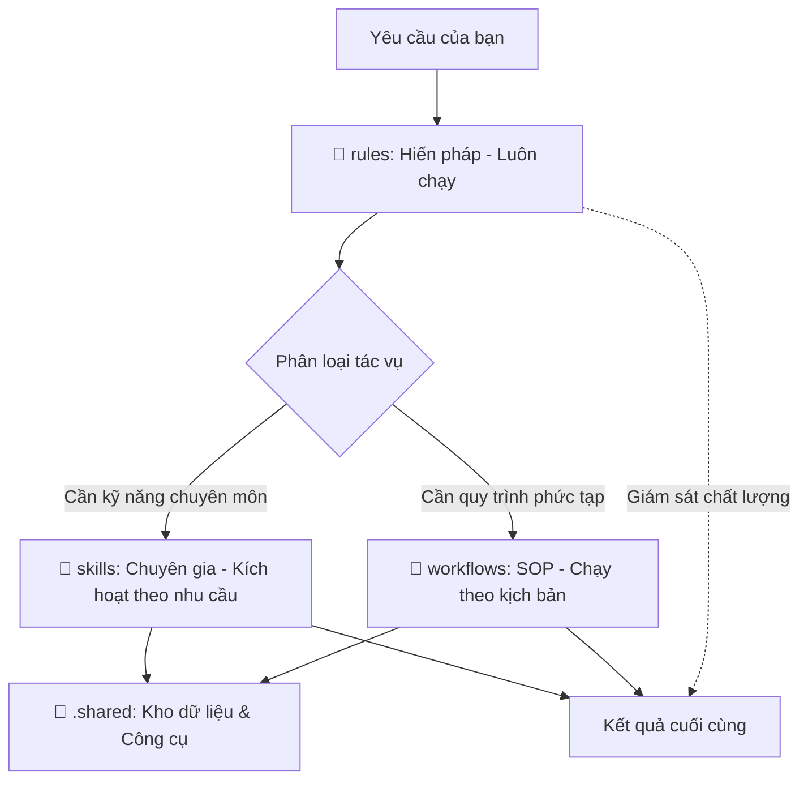

# Hướng dẫn Kỹ thuật: Hệ thống .agent (Agentic OS)

Hệ thống thư mục `.agent` hoạt động như một **Hệ điều hành cho AI (Agentic OS)**. Nó giúp tôi chuyển từ một "Chatbot thông thường" thành một "Kỹ sư phần mềm hiểu việc".

---

## 1. Bản đồ Tư duy & Luồng vận hành

---

## 2. Chi tiết Chức năng & Mối liên kết

### 📂 `rules/` (The Constitution - Hiến pháp)

- **Danh sách file chính:**
  - `01-identity.md`: Định nghĩa tôi là Kỹ sư Full-stack (Identity).
  - `08-communication.md`: Quy định cách tôi phản hồi ngắn gọn, hỗ trợ (Communication).
  - `07-technical-standards.md`: Các tiêu chuẩn code sạch, bảo mật (Standards).
- **Mối liên kết:** Là lớp "giám sát" cao nhất. Mọi hành động của Skills hay Workflows đều phải soi chiếu qua Rules.

### 📂 `skills/` (Expertise Modules - Mô-đun Chuyên gia)

- **Đặc điểm:** Chứa kiến thức sâu về từng công nghệ (React, Next.js, Auth, Database...).
- **Mối liên kết:** Cung cấp "nội lực" cho AI. Khi một Workflow cần xây dựng UI, nó sẽ "mượn" kiến thức từ `skills/css-expert` và `skills/react-expert`.

### 📂 `workflows/` (Action Plans - SOP)

- **Đặc điểm:** Các kịch bản từng bước để giải quyết tác vụ phức tạp (vd: `/ui-ux-pro-max`, `/request`).
- **Mối liên kết:** Là "nhạc trưởng" điều phối. Nó ra lệnh cho AI phải dùng Skill nào ở bước nào để đạt được mục tiêu cuối cùng.

---

## 3. Cách Cập nhật & Viết mới

Bạn có 2 cách để nâng cấp "bộ não" của tôi:

1. **Ủy thác:** Bảo tôi: _"Hãy cập nhật điều X vào Rules/Skills"_ -> Tôi tự viết file chuẩn AI.
2. **Thủ công:** Tự tạo file `.md` kèm Metadata (YAML) ở đầu.

---

## 4. Cài đặt & Phân phối Cá nhân

Để mang theo "bộ não" AI này đi khắp mọi nơi (GitHub riêng, npm/npx, Git Submodules):

> [!IMPORTANT]
> Xem hướng dẫn chi tiết từng bước (Step-by-Step) và các câu lệnh cài đặt tại:  
> 👉 **[AGENT_INSTALL_GUIDE.md](./AGENT_INSTALL_GUIDE.md)**

---

## 5. Tối ưu hóa & Hiệu năng

- **Lazy Loading (Tiết kiệm Token):** Tôi chỉ đọc những file thực sự cần thiết cho yêu cầu hiện tại, không nạp hết 100% để tránh lãng phí quota của bạn.
- **Scaling:** Hệ thống tự động lọc (Indexing) nên bạn có thể thêm hàng nghìn Skill mà tôi vẫn không bị loạn.
- **Global Folder:** Bạn có thể đặt `.agent` ở thư mục mẹ để dùng chung cho tất cả dự án con.

---

## 6. Tổng kết

Hệ thống `.agent` là **tài sản tri thức** lâu dài mã hóa dưới dạng file. Hãy nuôi nấng và mang nó theo bạn ở mọi nơi.

> [!TIP]
> Nếu thấy tôi lặp lại một lỗi, hãy bảo: **"Cập nhật điều này vào Rules/Skills"**. Đó chính là cách bạn "lập trình" lại tư duy của một AI.
