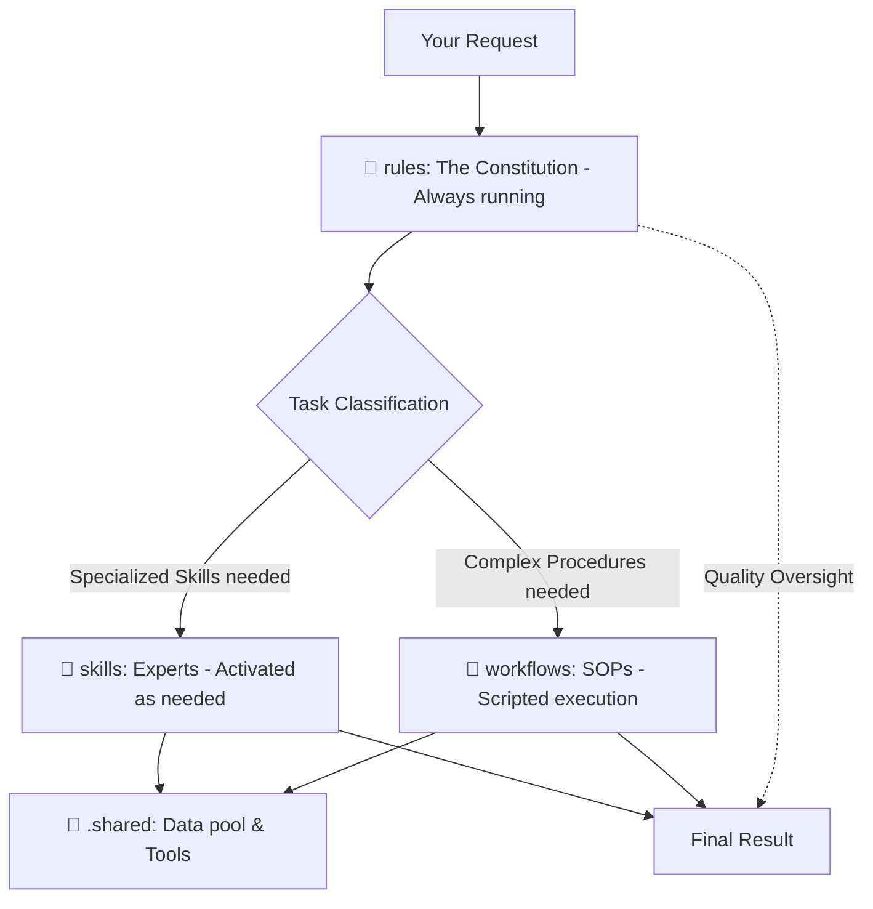

# Technical Guide: The .agent System (Agentic OS)

The `.agent` directory acts as an **Operating System for AI (Agentic OS)**. It helps me transition from a "regular chatbot" into a "context-aware software engineer."

---

## 1. Mental Map & Operation Flow

---

## 2. Functionality & Connections

### 📂 `rules/` (The Constitution)

- **Main Files:**
  - `01-identity.md`: Defines my persona as a Full-stack Engineer.
  - `08-communication.md`: Sets guidelines for concise and helpful responses.
  - `07-technical-standards.md`: Standards for clean code and security.
- **Connection:** This is the highest level of supervision. All actions taken by Skills or Workflows must align with the Rules.

### 📂 `skills/` (Expertise Modules)

- **Characteristics:** Contains deep knowledge of specific technologies (React, Next.js, Auth, Database, etc.).
- **Connection:** Provides the "expertise" for the AI. When a workflow needs to build UI, it "borrows" knowledge from `skills/css-expert` and `skills/react-expert`.

### 📂 `workflows/` (Action Plans - SOPs)

- **Characteristics:** Step-by-step scripts for solving complex tasks (e.g., `/ui-ux-pro-max`, `/request`).
- **Connection:** Acts as the "conductor." it coordinates which skills to use at which step to reach the final goal.

---

## 3. How to Update & Create New Items

You can upgrade my "brain" in two ways:

1. **Delegation:** Tell me: _"Update X in Rules/Skills"_ -> I will write the AI-standard file for you.
2. **Manual:** Create a `.md` file with YAML metadata at the top in the appropriate directory.

---

## 4. Personal Installation & Distribution

To take this AI "brain" with you anywhere (Private GitHub, npm/npx, Git Submodules):

> [!IMPORTANT]
> See step-by-step instructions and installation commands at:  
> 👉 **[AGENT_INSTALL_GUIDE_EN.md](./AGENT_INSTALL_GUIDE_EN.md)**

---

## 5. Optimization & Performance

- **Lazy Loading (Token Saving):** I only read files that are strictly necessary for the current request, rather than loading 100% of the kit, to save your quota.
- **Scaling:** The system uses automatic indexing, allowing you to add thousands of skills without me becoming confused.
- **Global Folder:** You can place the `.agent` folder in a parent directory to share it across multiple sub-projects.

---

## 6. Summary

The `.agent` system is your long-term **knowledge asset** encoded as files. Nurture it and take it with you everywhere.

> [!TIP]
> If you notice me repeating a mistake, tell me: **"Update this into Rules/Skills"**. That is how you "reprogram" the mindset of an AI.
